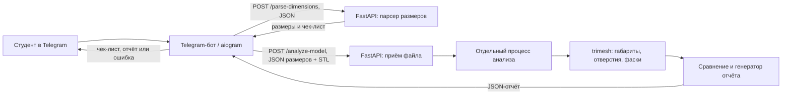
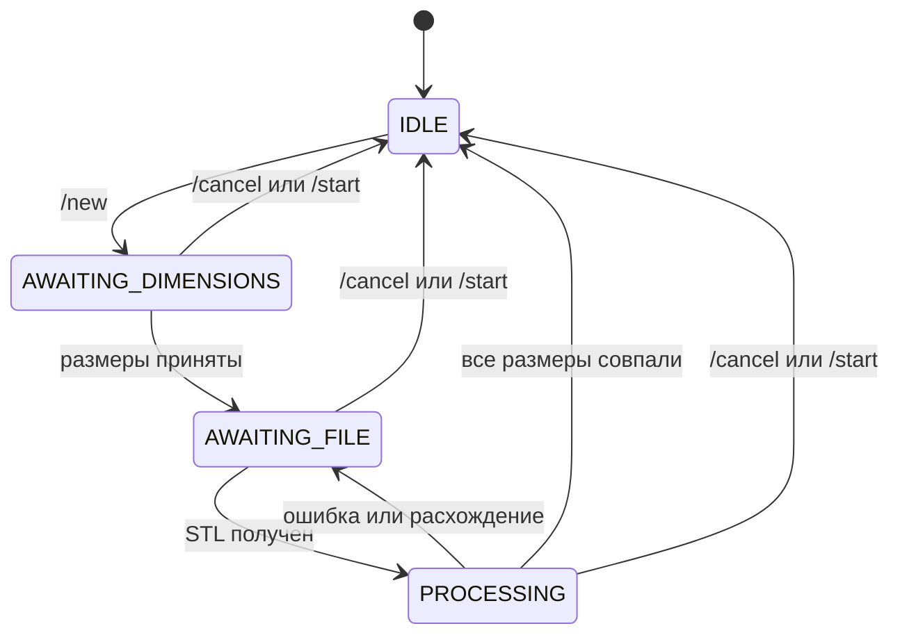

# Архитектура «Чертёжника»

Эта схема отражает компонентную диаграмму из раздела 2.2 PDF «Чертёжник — Архитектура и ТЗ» и текущую реализацию. Единственное встроенное изображение PDF показывает поток: студент в Telegram → Telegram Bot → FastAPI с парсером размеров, анализатором STL и генератором отчёта → Telegram Bot. Ниже тот же поток уточнён для работающего кода.

## Поток данных

1. `/new` создаёт сессию пользователя в памяти бота. `/start`, `/help`, `/cancel` управляют диалогом.
2. Бот передаёт введённый текст в `POST /parse-dimensions`. FastAPI проверяет формат, переводит единицы в миллиметры, определяет типы по `config.yaml` и возвращает размеры с чек-листом.
3. После чек-листа бот принимает STL как документ, сохраняет его временно в `.runtime/bot-uploads/` и отправляет с JSON-списком размеров в `POST /analyze-model` через localhost.
4. FastAPI ограничивает размер файла, записывает временную копию в `.runtime/uploads/` и запускает отдельный локальный процесс. Он проверяет замкнутость сетки, измеряет осевые габариты, ищет простые цилиндрические отверстия и фаски около 45°, сравнивает размеры с допуском и формирует текст отчёта. По истечении `timeout_sec` процесс завершается с ошибкой `TIMEOUT`.
5. FastAPI возвращает JSON-отчёт. Бот удаляет свою копию STL и отправляет готовый текст студенту. Копия FastAPI также удаляется после анализа или ошибки. При расхождениях и ошибках размеры остаются для повторной загрузки, после полного совпадения сессия завершается. История моделей и отчётов не хранится.

## Данные и состояния

| Сущность | Основные поля | Где используется |
| --- | --- | --- |
| `Session` | `user_id`, `state`, `dimensions`, `created_at` | Состояние диалога в памяти aiogram |
| `Dimension` | `name`, `value`, `unit`, `type`, `tolerance` | Контрольный размер после нормализации в мм |
| `Model` | `file_id`, `format`, `size_bytes`, `uploaded_at` | Описанная в ТЗ модель метаданных; файлы и метаданные не сохраняются в БД |
| `Report` | `session_id`, `matches`, `mismatches`, `summary`, `generated_at` | Одноразовый результат анализа; `telegram_text` — готовое сообщение для бота |
| `Match` / `Mismatch` | `dimension_name`, `expected`, `actual`, `delta` | Сравнение; если размер не найден, `actual` и `delta` равны `null` |

Внешний JSON использует поле `name` для элемента `matches`/`mismatches`, как в разделе 3.1 PDF; внутри модели оно называется `dimension_name`, как в разделе 2.3 PDF. Поле `telegram_text` дополняет пример ответа: оно позволяет формировать текст в FastAPI и только отправлять его ботом, согласно схеме ответственности в PDF.

## Контракты и ограничения

- `POST /parse-dimensions`: JSON `user_id`, `raw_text` → HTTP 200 с `dimensions`, `checklist` или `INVALID_FORMAT` 400.
- `POST /analyze-model`: multipart `user_id`, `dimensions` (JSON-строка), `file` (STL) → HTTP 200 с `report`. Коды ошибок: `INVALID_FORMAT` 400, `FILE_TOO_LARGE` 413, `INVALID_FILE` 422, `TIMEOUT` 504, `INTERNAL_ERROR` 500. Ошибки имеют поля `status`, `code`, `message`.
- Состояние хранится в памяти одного процесса бота. Два процесса работают через HTTP на localhost; БД, облачный анализ, OCR, STEP и история проверок не входят в MVP.
- Границы: текст до 2000 символов, STL до 10 МБ, до 30 контрольных размеров, допуск по умолчанию ±0,5 мм, анализ до 30 секунд, готовый Telegram-текст до 4000 символов, не более 10 одновременно работающих обработчиков API.
- Геометрия STL считается заданной в миллиметрах. Поддерживаются простые отверстия вдоль X/Y/Z; повёрнутые и сложные элементы могут не распознаться. Номера отверстий назначаются по положению центра, поскольку STL не хранит CAD-имён.

Параметры и правила ввода описаны в [конфигурации](configuration.md), запуск и ручная проверка — в [README](../README.md).
